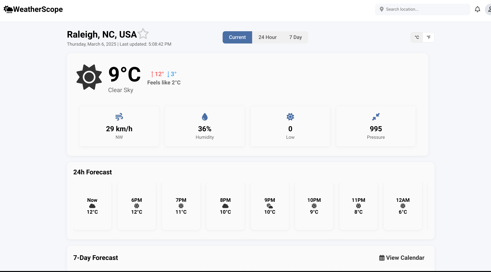
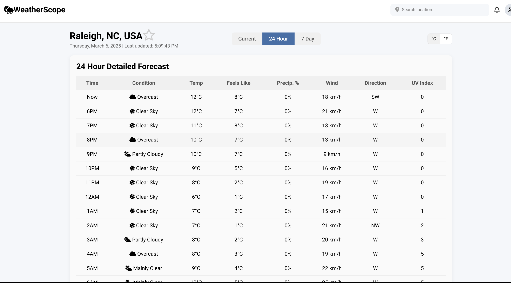
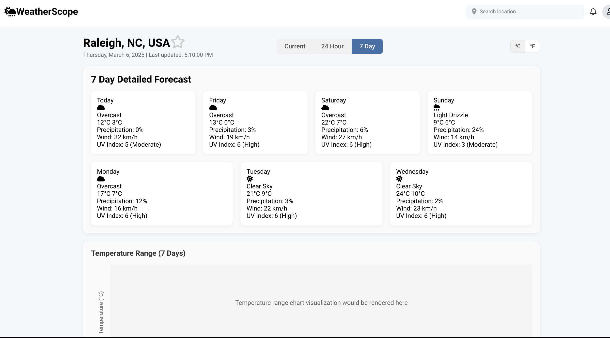

# WeatherScope - Weather Forecast Application

WeatherScope is a responsive web application that displays weather forecasts using the Open-Meteo Weather API.







## Features
- Current weather conditions
- 24-hour hourly forecast
- 7-day weather forecast
- Temperature unit conversion (°C/°F)
- Location search functionality
- Save favorite locations
- Detailed weather metrics (temperature, wind, humidity, UV index, etc.)

## Project Structure

weatherscope/
├── index.html           # Main page with current weather
├── hourly.html          # 24-hour forecast page
├── daily.html           # 7-day forecast page
├── README.md            # This file
├── css/
│   ├── styles.css       # Main stylesheet
│   ├── hourly.css       # Styles for hourly forecast
│   └── daily.css        # Styles for daily forecast
└── JavaScript/
    └── script.js        # Application logic

 
## How to Run the Application

1. Clone this repository:
   ```bash
   git clone git@github.com:StealthyScripter/Open-Mateo-Weather-app.git


2. Navigate to the project directory:
   ```bash
   cd Open-Mateo-Weather-app

3. Open any of the HTML files in your browser:

   index.html - Current weather
   hourly.html - 24-hour forecast
   daily.html - 7-day forecast


## Alternatively, you can use a local development server:

* Using Python (if installed):
   ```bash
      python -m http.server
   Then open http://localhost:8000 in your browser.
* Using Node.js (if installed):
   ```bash
      npx serve
   Then open the URL provided in the terminal.

##  API Usage
This application uses the Open-Meteo Weather API, which is free and does not require an API key.
API endpoints used:

   * Current weather: https://api.open-meteo.com/v1/forecast?current=temperature_2m,weather_code,wind_speed_10m
   * Hourly forecast: https://api.open-meteo.com/v1/forecast?hourly=temperature_2m,precipitation_probability,weather_code
   * Daily forecast: https://api.open-meteo.com/v1/forecast?daily=temperature_2m_max,temperature_2m_min,weather_code

## Technologies Used

      HTML5
      CSS3
      JavaScript (ES6+)
      Open-Meteo Weather API
      Font Awesome for icons

##  Browser Compatibility
The application is compatible with:

   - Google Chrome (latest)
   - Firefox (latest)
   - Safari (latest)
   - Edge (latest)

## Troubleshooting

# Common issues and solutions:

# Location not found
      - Ensure you're entering a valid city name
      - Try adding the country code (e.g., "London, UK")


#  Weather data not loading
      - Check your internet connection
      - Try refreshing the page
      - Clear your browser cache


#  Display issues
      - Ensure you're using a supported browser
      - Try disabling browser extensions that might interfere with JavaScript


## Future Improvements

   - Add weather alerts and notifications
   - Implement dark/light theme toggle
   - Add weather maps visualization
   - Improve accessibility features
   - Add multi-language support

### License
   MIT License

## Contributing
This version includes proper formatting for code snippets, consistent markdown structure, and more clarity in the sections. Let me know if you need any further adjustments!

